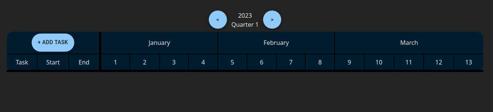
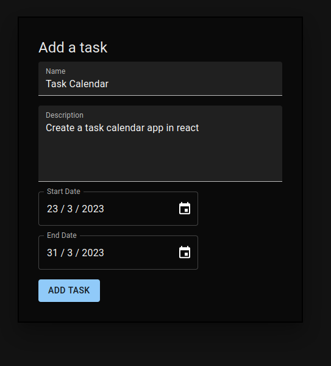
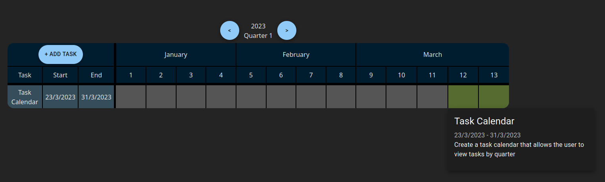
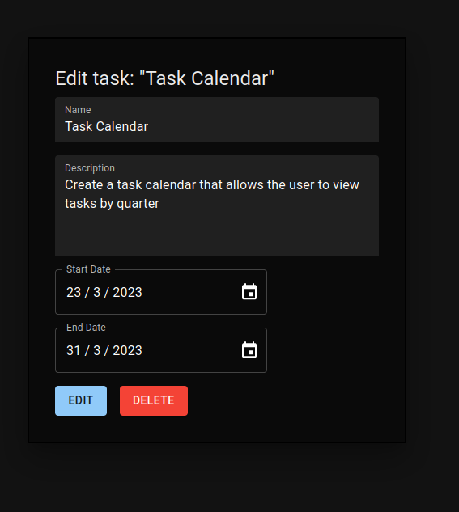

# Task calendar for quarters
## Introduction
This project is made to display tasks of a quarter as a calendar divided into weeks . It was created using React 18.2 + Vite

To get started with the project, please follow the instructions below.
## Running the app in development server with npm

After downloading or cloning the repository navigate to the root directory of the repository and run the following command to install dependencies:
```sh
npm install
```
To start the development server run command

```sh
npm run dev
```

This command also shows you the url from which you can access the development server

## Usage

### When you first go to the page there will be no tasks in the calendar.



### After clicking Add Task button there is a popup that allows you to add a task



### You can hover over the green active cells of the task in the table to show little hovercard with tasks details



### When clicking anywhere on the task row you can edit or delete the task

